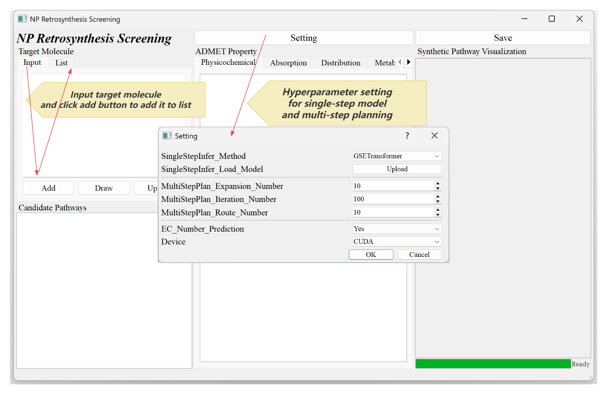
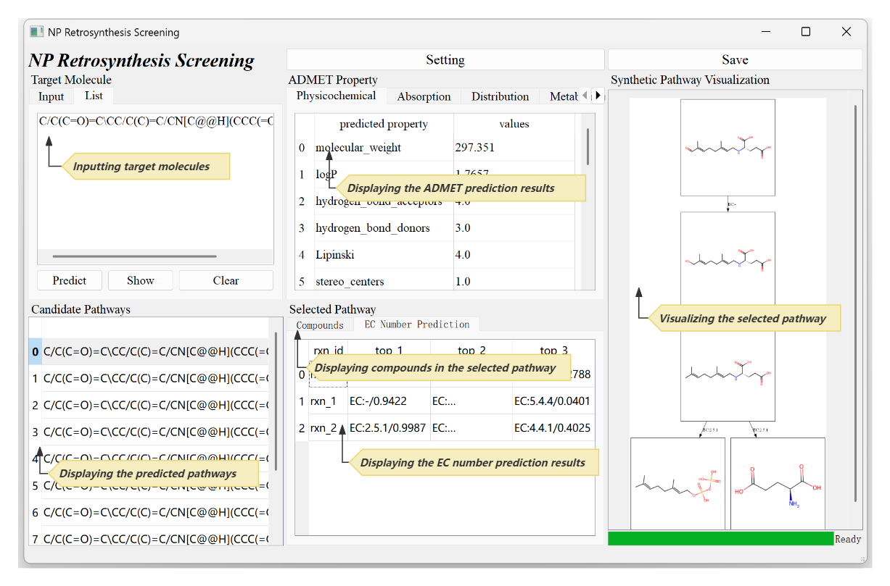

# GSETRetro
## 0. Requirements
Create a virtual environment and install the dependencies.<br>
Install pytorch with the cuda version that fits your device.<br>
```
conda create -n GSETRetro_env python=3.10
conda activate GSETRetro_env
pip install torch==1.13.0+cu117 torchvision==0.14.0+cu117 torchaudio==0.13.0 --extra-index-url https://download.pytorch.org/whl/cu117
pip install torchtext==0.6.0 torch_geometric==2.3.1 configargparse tensorboardX==2.6.2.2 textdistance==4.2.2 rxnmapper==0.3.0
pip install admet-ai==1.3.0  graphviz pyqt5  pyqtwebengine numpy==1.26.4
```
## 1. Data and Checkpoints
The data and checkpoints used to reproduce the results of the paper can be accessed via the link: 
https://drive.google.com/drive/folders/1tHuqdjdu2kxQChS2x-z1n3Hnhf-0rDBt  </br>
- For the Biochem dataset </br>
The raw data is originally sourced from: https://github.com/zengtsysu/BioNavi </br>
Further processed raw data used for this paper is obtained from: https://github.com/SeulLee05/READRetro </br>
- For the USPTO-50K dataset </br>
The raw data is obtained from: https://github.com/Hanjun-Dai/GLN </br>
The 20x augmented data is obtained from: https://github.com/otori-bird/retrosynthesis </br>
- The directory structure is shown below, and the relevant files downloaded from the above link should be placed accordingly:
```
GSETRetro
├───GSETransformer
│   ├───data
│   │   ├───biochem_npl_20xaug
│   │   │  └───src-train.txt/tgt-train.txt/src-val.txt/tgt-val.txt/src-test.txt/tgt-test.txt …
│   │   │
│   │   └───uspto_50k_20xaug
│   │       └───src-train.txt/tgt-train.txt/src-val.txt/tgt-val.txt/src-test.txt/tgt-test.txt …
│   ├───experiments
│   │    ├───biochem_npl_20xaug
│   │    │   └───model_step_xx.pt
│   │    │
│   │    └───uspto_50k_20xaug   
│   │        └───model_step_xx.pt
│   └─……
├───data       
├───retro_star
├───utils      
└───……
```
## 2. Single-step Model Traning and Evaluation
`cd GSETransformer`. Switch to the single-step-model folder to proceed.
### (2.1)To preprocess the data:
Run the following command to generate augmented data. </br>
If you have already downloaded the data from the link, you can skip this step. </br>
```
python data_utils/data_aug_with_RSMILES.py -dataset biochem_npl -augmentation 20 
```
Generate the files used for training. This step is necessary and cannot be skipped.</br>
It will generate one `.pt` file and one `.pkl` file each for the train and valid data.</br>
```
python preprocess.py -train_src data/biochem_npl_20xaug/src-train.txt -train_tgt data/biochem_npl_20xaug/tgt-train.txt \
                     -valid_src data/biochem_npl_20xaug/src-val.txt  -valid_tgt data/biochem_npl_20xaug/tgt-val.txt  \
                     -save_data data/biochem_npl_20xaug/biochem_npl_20xaug  \
                     -src_seq_length 1000 -tgt_seq_length 1000 -src_vocab_size 1000 -tgt_vocab_size 1000 -share_vocab
``` 
### (2.2)To train the model:
```
CUDA_VISIBLE_DEVICES=${gpu_id}   \
python  train.py -data  data/biochem_npl_20xaug/biochem_npl_20xaug \
                 -save_model experiments/biochem_npl_20xaug/model \
                 -seed 2024 -gpu_ranks 0 -save_checkpoint_steps 10000  \
                 -train_steps 500000 -valid_steps 1000 -report_every 1000 \
                 -param_init 0 -param_init_glorot \
                 -batch_size 4096 -batch_type tokens -normalization tokens \
                 -dropout 0.3 -max_grad_norm 0 -accum_count 4 -learning_rate 2 -label_smoothing 0.0 \
                 -optim adam -adam_beta1 0.9 -adam_beta2 0.998 -decay_method noam -warmup_steps 8000  \
                 -enc_layers 6 -dec_layers 6 -rnn_size 512 -word_vec_size 512 \
                 -encoder_type transformer -decoder_type transformer \
                 -share_embeddings -position_encoding -max_generator_batches 32 \
                 -global_attention general -global_attention_function softmax \
                 -self_attn_type scaled-dot -max_relative_positions 4 \
                 -heads 8 -transformer_ff 2048  -early_stopping 100 -keep_checkpoint 10 \
                 -tensorboard -tensorboard_log_dir runs/biochem_npl_20xaug 2>&1 | tee runs/biochem_npl_20xaug.log
```
Noted that the hyperparameters `-rnn_size` and `-word_vec_size` are set to 256 for USPTO and 512 for Biochem. Intuitively, the larger the vocab size, the larger these parameters should be.
### (2.3) To generate prediction and score the output results:
```
CUDA_VISIBLE_DEVICES=${gpu_id}   \
python translate_with_src_aug.py -model experiments/biochem_npl_20xaug/model_best_acc_step_355000.pt   \
                    -src data/biochem_npl_20xaug/src-test.txt -tgt data/biochem_npl_20xaug/tgt-test.txt \
                    -output data/biochem_npl_20xaug/pred_model_best_acc_step_355000_n10b10.txt \
                    -replace_unk  -gpu 0  -beam_size 10 -n_best 10 -src_aug_time 20
```
Noted that the hyperparameters for USPTO-50k are set as: `-beam_size 10 -n_best 50`. </br>
if `-tgt` above is given, the script will automatically score the output results.</br>
## 3.Multi-step Planning and Evaluation
### (3.1) To plan retrosynthetic routes：
Run the following command to plan paths of multiple products using multiprocessing:
```
CUDA_VISIBLE_DEVICES=${gpu_id} python run_mp.py
```
### (3.2) To evaluate the result of the previous step：
Run the following command to evaluate the planned paths of the test molecules:
```
python eval.py ${save_file}
```
## 4.GUI usage
1. Run `python NPRetro_GUI.py` to open the GUI interface.</br>
2. Click the `Setting` button to modify the hyperparameters. The default hyperparameters are those used in the paper.</br>
Pls download our trained model first, if you place the model file (.pt) at a random path instead of following the complex directory structure mentioned above, you can specify its location through the `Setting-Upload` option.
3. Enter the target molecule in the `Input` field and click the `Add` button to add it to the `List`.</br>

3. Switch to the `List` field and click the `Predict` button to perform the routes prediction.</br>
If predicted routes are obtained, click random route to view the details.</br>

